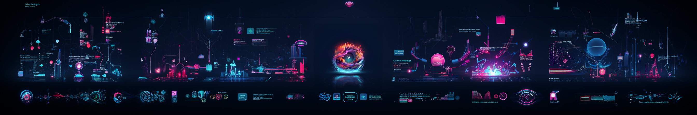

# 🚀 ViralWave AI Content Crafter

### Unleash trends! Catch viral waves and craft captivating content with ViralWave AI.

## Target Audience and Problem Statement

For content creators (initially targeting podcasters) needing timely viral trends, ViralWave AI Content Crafter eradicates the struggle of finding, summarizing, and script crafting for trending topics, ensuring always-relevant and engaging content creation.

<b>Target Audience</b>: Content creators, including podcasters, YouTubers, and social media influencers, seeking to stay ahead in the trend game by easily finding, leveraging the latest viral topics, and receiving suggested scripts for their content.

<b>Problem Statement</b>: In the ever-evolving digital landscape, content creators grapple with the timely discovery of viral topics and crafting engaging narratives around them, impeding their ability to consistently produce timely, relevant, and captivating content, thereby limiting their audience engagement and growth.

## 🌟 Project Overview

Imagine a powerful AI tool that effortlessly sifts through the boundless realms of the internet, tirelessly pulling the latest and most viral topics from your specified list of websites. Always stay up-to-date with the freshest viral topics and the creators who are making waves about them.

ViralWave AI Content Crafter dives deep into your chosen topic, summarizing key points with precision, and seamlessly attaching relevant references. It employs a Large Language Model to transmute this concise information into an engaging script for your podcast or YouTube channel. It's not just a tool, it's your companion in staying ahead of the trend game, always.

## 🎉 Key Highlights

### 🌐 **Content Aggregation**
- Navigate the vast internet seamlessly.
- Smartly scrapes listed news websites.
- Ensures you're updated with the latest articles, news, and topic-specific information.

### 🔗 **Social Media Integration**
- Unleash the power of social platforms.
- Effortless integration with Twitter, LinkedIn, Instagram, and TikTok.
- Access the most relevant and trending content, posts, articles, videos, and discussions.

### 🏷️ **Topic Categorization**
- Automatic classification into distinct topics.
- Make your hunt for niche-specific information a walk in the park.

### ✍️ **Content Generation**
- Craft engaging and concise content pieces.
- Tailored for different platforms including social media, professional networking sites, and podcast scripts.

### 🤖 **Automation and Efficiency**
- Experience unprecedented automation in content aggregation, categorization, and generation.
- Ensure a timely and efficient content creation process, ready for immediate publishing.

---

Step into the future with ViralWave AI Content Crafter. Transform your content creation journey into an expedition of ease, efficiency, and excellence. Stay ahead, stay updated, and let your content resonate with the pulse of the latest trends with us! 🚀

